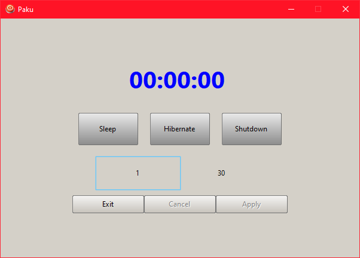
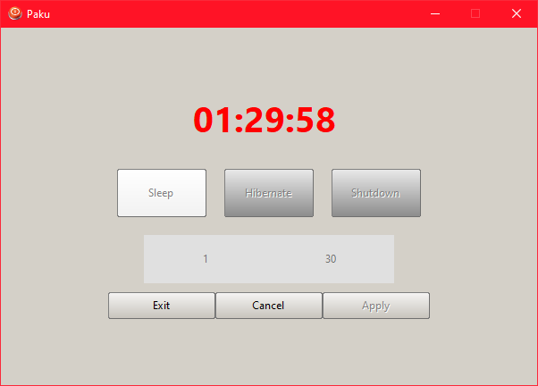

# Kapu

Application to put in standby, in hibernation, or shut down a Windows workstation after a certain time. (Windows only)

| DOWNLOADS |
:----------------------------------------------------------: |
|  | 

> Uses https://nanapro.org/ (1.7.4)
